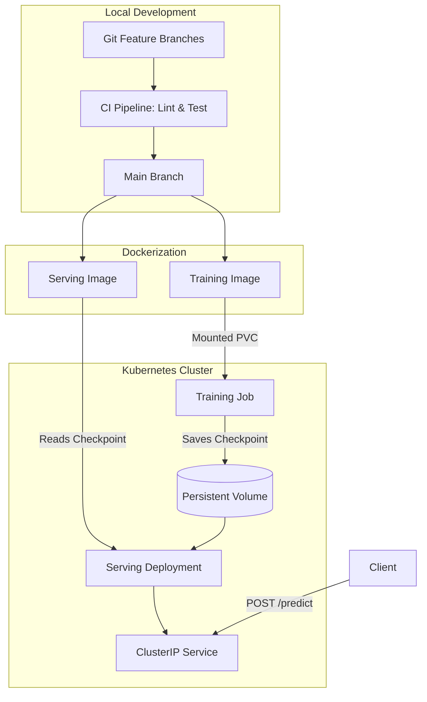

# MLOps PyTorch Pipeline

A production-style Machine Learning pipeline demonstrating the end-to-end deployment of a PyTorch image classification model using Docker and Kubernetes. 
Github Link: https://github.com/Madhava-Ketha/mlops-pytorch-pipeline
Github Last PR link: https://github.com/Madhava-Ketha/mlops-pytorch-pipeline/pull/5
## Architecture Overview



## Repository Structure

- `src/`: PyTorch ResNet-18 model, CIFAR-10 dataloaders, training loop, and FastAPI serving script.
- `configs/`: YAML configuration for hyperparameters and paths.
- `docker/`: Multi-stage Dockerfiles for training and inference.
- `k8s/`: Kubernetes manifests (Job, Deployment, Service, ConfigMap, HPA).
- `.github/workflows/`: Automated CI pipeline for linting (flake8) and testing (pytest).

## Setup & Deployment Instructions

### 1. Build Docker Images
Build the container images directly from your terminal:
```bash
docker build -f docker/Dockerfile.train -t mlops-train:v1 .
docker build -f docker/Dockerfile.serve -t mlops-serve:v1 .
```

### 2. Deploy to Kubernetes
Apply the manifests sequentially to create the namespace, configuration, and storage:
```bash
kubectl apply -f k8s/namespace.yaml
kubectl apply -f k8s/configmap.yaml
```

Run the training job to train the model and save the checkpoint to the persistent volume:
```bash
kubectl apply -f k8s/training-job.yaml
```

Once the training job completes, spin up the serving replicas:
```bash
kubectl apply -f k8s/serving-deployment.yaml
kubectl apply -f k8s/serving-service.yaml
kubectl apply -f k8s/hpa.yaml
```

### 3. Verify Deployment
Check the status of your pods to ensure the readiness and liveness probes are passing:
```bash
kubectl get pods -n ml-training
```

### 4. Test the Prediction Endpoint
Establish a port-forward to route local traffic to the cluster service:
```bash
kubectl port-forward svc/model-serving 8080:80 -n ml-training
```

In a new terminal, send a test image to the FastAPI prediction endpoint using Python:
```python
import requests

url = "http://localhost:8080/predict"
files = {"image": ("test_image.jpg", open("test_image.jpg", "rb"), "image/jpeg")}

response = requests.post(url, files=files)
print(response.text)
```